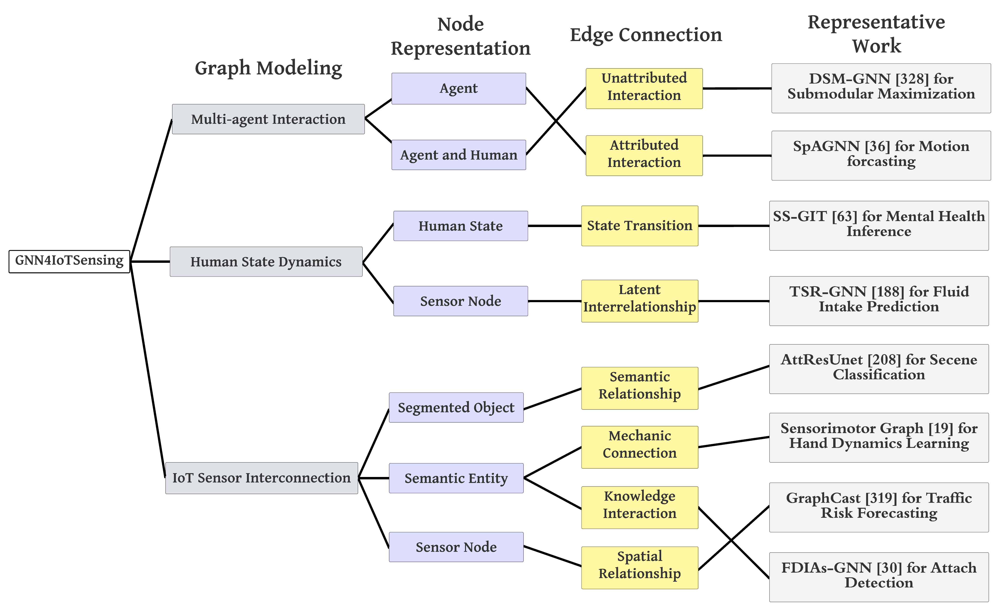

# GNN4IoT
### This is the repository for the collection of applying Graph Neural Networks in Internet of Things (IoT).

#### If you find this repository helpful, you may consider cite our work:
* Guimin Dong, Mingyue Tang, Zhiyuan Wang, Jiechao Gao, Sikun Guo, Lihua Cai, Robert Gutierrez, Bradford Campbell, Laura E. Barnes, Mehdi Boukhechba, <b>Graph Neural Networks in IoT: A Survey</b>.

### We categorize GNNs in IoT into the following groups based on their semantics of graph modeling: 
**1）Multi-agent Interaction**, **2）Human State Dynamics**, and **3）IoT Sensor Interconnection.**

### Multi-agent Interaction:
* Zhou, Yang, et al. "Multi-Robot Collaborative Perception with Graph Neural Networks." IEEE Robotics and Automation Letters (2022). [Link](https://ieeexplore.ieee.org/iel7/7083369/7339444/09676458.pdf)
* Li, Zirui, et al. "Interactive Behavior Prediction for Heterogeneous Traffic Participants in the Urban Road: A Graph-Neural-Network-Based Multitask Learning Framework." IEEE/ASME Transactions on Mechatronics 26.3 (2021): 1339-1349. [Link](https://ieeexplore.ieee.org/stamp/stamp.jsp?arnumber=9406384)
* Jo, Eunsan, Myoungho Sunwoo, and Minchul Lee. "Vehicle Trajectory Prediction Using Hierarchical Graph Neural Network for Considering Interaction among Multimodal Maneuvers." Sensors 21.16 (2021): 5354. [Link](https://www.mdpi.com/1424-8220/21/16/5354/pdf)
* Rangesh, Akshay, et al. "Trackmpnn: A message passing graph neural architecture for multi-object tracking." arXiv preprint arXiv:2101.04206 (2021). [Link](https://arxiv.org/pdf/2101.04206.pdf?ref=https://githubhelp.com)
* Chen, Sikai, et al. "Graph neural network and reinforcement learning for multi‐agent cooperative control of connected autonomous vehicles." Computer‐Aided Civil and Infrastructure Engineering 36.7 (2021): 838-857. [Link](https://onlinelibrary.wiley.com/doi/pdf/10.1111/mice.12702)
* Zhou, Lifeng, et al. "Graph neural networks for decentralized multi-robot submodular action selection." arXiv preprint arXiv:2105.08601 (2021). [Link](https://arxiv.org/pdf/2105.08601)
* Ma, Hengbo, et al. "Continual multi-agent interaction behavior prediction with conditional generative memory." IEEE Robotics and Automation Letters 6.4 (2021): 8410-8417. [Link](https://ieeexplore.ieee.org/iel7/7083369/7339444/09512468.pdf)
* Dong, Bo, et al. "Multi-modal trajectory prediction for autonomous driving with semantic map and dynamic graph attention network." arXiv preprint arXiv:2103.16273 (2021). [Link](https://arxiv.org/pdf/2103.16273.pdf?ref=https://githubhelp.com)
* Weng, Xinshuo, Ye Yuan, and Kris Kitani. "PTP: Parallelized tracking and prediction with graph neural networks and diversity sampling." IEEE Robotics and Automation Letters 6.3 (2021): 4640-4647. [Link](https://ieeexplore.ieee.org/iel7/7083369/7339444/09387598.pdf)
* Chen, Junan, et al. "Spatial-Temporal Graph Neural Network For Interaction-Aware Vehicle Trajectory Prediction." 2021 IEEE 17th International Conference on Automation Science and Engineering (CASE). IEEE, 2021. [Link](https://ieeexplore.ieee.org/iel7/9551387/9551265/09551450.pdf)
* Li, Kunming, et al. "Attentional-GCNN: Adaptive Pedestrian Trajectory Prediction towards Generic Autonomous Vehicle Use Cases." 2021 IEEE International Conference on Robotics and Automation (ICRA). IEEE, 2021. [Link](https://ieeexplore.ieee.org/iel7/9560720/9560666/09561480.pdf)
* Casas, Sergio, et al. "Spagnn: Spatially-aware graph neural networks for relational behavior forecasting from sensor data." 2020 IEEE International Conference on Robotics and Automation (ICRA). IEEE, 2020. [Link](https://ieeexplore.ieee.org/abstract/document/9196697?casa_token=Tit2yCbnIwgAAAAA:o6YT-OmwgvOFZcr2M1Vl1KCFq7vHpeQG7b8hFwvawVWacN-7-RKm2Q4Jl_0iGt0VLzRUVVWbKuE)
* Tolstaya, Ekaterina, et al. "Multi-robot coverage and exploration using spatial graph neural networks." 2021 IEEE/RSJ International Conference on Intelligent Robots and Systems (IROS). IEEE, 2020. [Link](https://ieeexplore.ieee.org/iel7/9635848/9635849/09636675.pdf)
* Mo, Xiaoyu, Yang Xing, and Chen Lv. "Recog: A deep learning framework with heterogeneous graph for interaction-aware trajectory prediction." arXiv preprint arXiv:2012.05032 (2020). [Link](https://arxiv.org/pdf/2012.05032)
* Mohamed, Abduallah, et al. "Social-stgcnn: A social spatio-temporal graph convolutional neural network for human trajectory prediction." Proceedings of the IEEE/CVF Conference on Computer Vision and Pattern Recognition. 2020. [Link](https://openaccess.thecvf.com/content_CVPR_2020/papers/Mohamed_Social-STGCNN_A_Social_Spatio-Temporal_Graph_Convolutional_Neural_Network_for_Human_CVPR_2020_paper.pdf)
* Eiffert, Stuart, et al. "Probabilistic crowd GAN: Multimodal pedestrian trajectory prediction using a graph vehicle-pedestrian attention network." IEEE Robotics and Automation Letters 5.4 (2020): 5026-5033. [Link](https://ieeexplore.ieee.org/iel7/7083369/7339444/09123560.pdf)
* Li, Jiachen, et al. "Social-wagdat: Interaction-aware trajectory prediction via wasserstein graph double-attention network." arXiv preprint arXiv:2002.06241 (2020). [Link](https://arxiv.org/pdf/2002.06241)
* Lee, Donsuk, et al. "Joint interaction and trajectory prediction for autonomous driving using graph neural networks." arXiv preprint arXiv:1912.07882 (2019). [Link](https://arxiv.org/pdf/1912.07882.pdf)
* Kosaraju, Vineet, et al. "Social-bigat: Multimodal trajectory forecasting using bicycle-gan and graph attention networks." Advances in Neural Information Processing Systems 32 (2019). [Link](https://proceedings.neurips.cc/paper/2019/file/d09bf41544a3365a46c9077ebb5e35c3-Paper.pdf)

### Human State Dynamics:
* Dong, Guimin, et al. "Semi-supervised Graph Instance Transformer for Mental Health Inference." 2021 20th IEEE International Conference on Machine Learning and Applications (ICMLA). IEEE, 2021. [Link](https://ieeexplore.ieee.org/abstract/document/9679981?casa_token=NZktpSySDKUAAAAA:9yAScp6BkRfYUUOwXfUmMWRg2TG6bEQJ3xnVSRMk0R1g2_TMUr_toVJyA9RXcawOHayjBbRFyKg)
* Li, Jingcong, et al. "Cross-Subject EEG Emotion Recognition With Self-Organized Graph Neural Network." Frontiers in Neuroscience (2021): 689. [Link](https://www.frontiersin.org/articles/10.3389/fnins.2021.611653/full)
* Dong, Guimin, et al. "Using graph representation learning to predict salivary cortisol levels in pancreatic cancer patients." Journal of Healthcare Informatics Research 5.4 (2021): 401-419. [Link](https://link.springer.com/article/10.1007/s41666-021-00098-4)
* Dong, Guimin, et al. "Influenza-like symptom recognition using mobile sensing and graph neural networks." Proceedings of the Conference on Health, Inference, and Learning. 2021. [Link](https://dl.acm.org/doi/pdf/10.1145/3450439.3451880)
* Dong, Guimin, et al. "Using graph representation learning to predict salivary cortisol levels in pancreatic cancer patients." Journal of Healthcare Informatics Research 5.4 (2021): 401-419. [Link](https://link.springer.com/article/10.1007/s41666-021-00098-4)
* Wagh, Neeraj, and Yogatheesan Varatharajah. "Eeg-gcnn: Augmenting electroencephalogram-based neurological disease diagnosis using a domain-guided graph convolutional neural network." Machine Learning for Health. PMLR, 2020. [Link](http://proceedings.mlr.press/v136/wagh20a/wagh20a.pdf)
* Lun, Xiangmin, et al. "GCNs-net: a graph convolutional neural network approach for decoding time-resolved eeg motor imagery signals." arXiv preprint arXiv:2006.08924 (2020). [Link](https://arxiv.org/pdf/2006.08924)
* Wagh, Neeraj, and Yogatheesan Varatharajah. "Eeg-gcnn: Augmenting electroencephalogram-based neurological disease diagnosis using a domain-guided graph convolutional neural network." Machine Learning for Health. PMLR, 2020. [Link](http://proceedings.mlr.press/v136/wagh20a/wagh20a.pdf)
* Lun, Xiangmin, et al. "GCNs-net: a graph convolutional neural network approach for decoding time-resolved eeg motor imagery signals." arXiv preprint arXiv:2006.08924 (2020). [Link](https://arxiv.org/pdf/2006.08924)
* Zhong, Peixiang, Di Wang, and Chunyan Miao. "EEG-based emotion recognition using regularized graph neural networks." IEEE Transactions on Affective Computing (2020). [Link](https://ieeexplore.ieee.org/stamp/stamp.jsp?arnumber=9091308)
* Li, Xiaoyu, et al. "Classify EEG and reveal latent graph structure with spatio-temporal graph convolutional neural network." 2019 IEEE International Conference on Data Mining (ICDM). IEEE, 2019. [Link](https://ieeexplore.ieee.org/iel7/8961330/8970627/08970787.pdf)
* Han, Jindong, et al. "GraphConvLSTM: Spatiotemporal Learning for Activity Recognition with Wearable Sensors." 2019 IEEE Global Communications Conference (GLOBECOM). IEEE, 2019. [Link](https://ieeexplore.ieee.org/iel7/8968653/9013108/09013934.pdf)
* Song, Tengfei, et al. "EEG emotion recognition using dynamical graph convolutional neural networks." IEEE Transactions on Affective Computing 11.3 (2018): 532-541. [Link](https://ieeexplore.ieee.org/iel7/5165369/5520654/08320798.pdf)
* Jang, Soobeom, Seong-Eun Moon, and Jong-Seok Lee. "EEG-based video identification using graph signal modeling and graph convolutional neural network." 2018 IEEE International Conference on Acoustics, Speech and Signal Processing (ICASSP). IEEE, 2018. [Link](https://ieeexplore.ieee.org/iel7/8450881/8461260/08462207.pdf)

### IoT Sensor Interconnection:
* Shrivastava, Namita, Amit Bhagat, and Rajit Nair. "Graph Powered Machine Learning in Smart Sensor Networks." Smart Sensor Networks. Springer, Cham, 2022. 209-226. [Link](https://link.springer.com/chapter/10.1007/978-3-030-77214-7_9)
* Deng, Ailin, and Bryan Hooi. "Graph neural network-based anomaly detection in multivariate time series." Proceedings of the AAAI Conference on Artificial Intelligence. Vol. 35. No. 5. 2021. [Link](https://www.aaai.org/AAAI21Papers/AAAI-5076.DengA.pdf)
* Lin, Dan, et al. "Multilabel aerial image classification with a concept attention graph neural network." IEEE Transactions on Geoscience and Remote Sensing 60 (2021): 1-12. [Link](https://ieeexplore.ieee.org/iel7/36/4358825/09366909.pdf)
* Ding, Yao, et al. "Semi-supervised locality preserving dense graph neural network with ARMA filters and context-aware learning for hyperspectral image classification." IEEE Transactions on Geoscience and Remote Sensing (2021). [Link](https://ieeexplore.ieee.org/stamp/stamp.jsp?arnumber=9506991)
* Almeida, João Damião, et al. "SENSORIMOTOR GRAPH: Action-Conditioned Graph Neural Network for Learning Robotic Soft Hand Dynamics." 2021 IEEE/RSJ International Conference on Intelligent Robots and Systems (IROS). IEEE, 2021. [Link](https://ieeexplore.ieee.org/iel7/9635848/9635849/09636377.pdf)
* Fischer, Kai, et al. "StickyPillars: Robust and efficient feature matching on point clouds using graph neural networks." Proceedings of the IEEE/CVF Conference on Computer Vision and Pattern Recognition. 2021. [Link](http://openaccess.thecvf.com/content/CVPR2021/papers/Fischer_StickyPillars_Robust_and_Efficient_Feature_Matching_on_Point_Clouds_Using_CVPR_2021_paper.pdf)
* Tekbıyık, Kürşat, et al. "Graph attention networks for channel estimation in RIS-assisted satellite IoT communications." arXiv preprint arXiv:2104.00735 (2021). [Link](https://arxiv.org/pdf/2104.00735)
* Boyaci, Osman, et al. "Graph neural networks based detection of stealth false data injection attacks in smart grids." IEEE Systems Journal (2021). [Link](https://ieeexplore.ieee.org/iel7/4267003/4357939/09582826.pdf)
* Xu, Aidong, et al. "Graph-Based Time Series Edge Anomaly Detection in Smart Grid." 2021 7th IEEE Intl Conference on Big Data Security on Cloud (BigDataSecurity), IEEE Intl Conference on High Performance and Smart Computing,(HPSC) and IEEE Intl Conference on Intelligent Data and Security (IDS). IEEE, 2021. [Link](https://ieeexplore.ieee.org/abstract/document/9463564)
* Lo, Wai Weng, et al. "E-graphsage: A graph neural network based intrusion detection system." arXiv preprint arXiv:2103.16329 (2021). [Link](https://arxiv.org/pdf/2103.16329)
* Wu, Yulei, Hong-Ning Dai, and Haina Tang. "Graph neural networks for anomaly detection in industrial internet of things." IEEE Internet of Things Journal (2021). [Link](https://ieeexplore.ieee.org/iel7/6488907/6702522/09471816.pdf)
* Ouyang, Xiaocao, et al. "Spatial-Temporal Dynamic Graph Convolution Neural Network for Air Quality Prediction." 2021 International Joint Conference on Neural Networks (IJCNN). IEEE, 2021. [Link](https://ieeexplore.ieee.org/iel7/9533266/9533267/09534167.pdf)
* Ouyang, Song, and Yansheng Li. "Combining deep semantic segmentation network and graph convolutional neural network for semantic segmentation of remote sensing imagery." Remote Sensing 13.1 (2020): 119. [Link](https://www.mdpi.com/2072-4292/13/1/119/pdf)
* Liang, Jiali, Yufan Deng, and Dan Zeng. "A deep neural network combined CNN and GCN for remote sensing scene classification." IEEE Journal of Selected Topics in Applied Earth Observations and Remote Sensing 13 (2020): 4325-4338. [Link](https://ieeexplore.ieee.org/iel7/4609443/8994817/09149910.pdf)
* Zou, Xiaofeng, Kenli Li, and Cen Chen. "Multilevel Attention Based U-Shape Graph Neural Network for Point Clouds Learning." IEEE Transactions on Industrial Informatics 18.1 (2020): 448-456. [Link](https://ieeexplore.ieee.org/iel7/9424/9559748/09302662.pdf)
* Narwariya, Jyoti, et al. "Graph neural networks for leveraging industrial equipment structure: An application to remaining useful life estimation." arXiv preprint arXiv:2006.16556 (2020). [Link](https://arxiv.org/pdf/2006.16556.pdf)
* Chen, Mengyuan, et al. "Inference for network structure and dynamics from time series data via graph neural network." arXiv preprint arXiv:2001.06576 (2020). [Link](https://arxiv.org/pdf/2001.06576)
* Wu, Zonghan, et al. "Connecting the dots: Multivariate time series forecasting with graph neural networks." Proceedings of the 26th ACM SIGKDD International Conference on Knowledge Discovery & Data Mining. 2020. [Link](https://dl.acm.org/doi/pdf/10.1145/3394486.3403118)
* Zhang, Yang, et al. "A multi-modal graph neural network approach to traffic risk forecasting in smart urban sensing." 2020 17th Annual IEEE international conference on sensing, communication, and networking (SECON). IEEE, 2020. [Link](https://ieeexplore.ieee.org/iel7/9148594/9158408/09158447.pdf)
* Zhang, Weijia, et al. "Semi-supervised hierarchical recurrent graph neural network for city-wide parking availability prediction." Proceedings of the AAAI Conference on Artificial Intelligence. Vol. 34. No. 01. 2020. [Link](https://ojs.aaai.org/index.php/AAAI/article/download/5471/5327)
* Zhang, Weishan, et al. "Modeling IoT equipment with graph neural networks." IEEE Access 7 (2019): 32754-32764. [Link](https://ieeexplore.ieee.org/abstract/document/8658112)
* Bi, Yin, et al. "Graph-based object classification for neuromorphic vision sensing." Proceedings of the IEEE/CVF International Conference on Computer Vision. 2019. [Link](http://openaccess.thecvf.com/content_ICCV_2019/papers/Bi_Graph-Based_Object_Classification_for_Neuromorphic_Vision_Sensing_ICCV_2019_paper.pdf)
* Chen, Cen, et al. "Gated residual recurrent graph neural networks for traffic prediction." Proceedings of the AAAI conference on artificial intelligence. Vol. 33. No. 01. 2019. [Link](https://ojs.aaai.org/index.php/AAAI/article/view/3821/3699)

### Relavant Public Dataset for GNN in IoT:
### Public Datasets

Dataset used or potential helpful in GNN-related research.

#### Human Acitivity Recognition (HAR)

| Name                                                         | Feature                                                      | Link                                                         |
| ------------------------------------------------------------ | ------------------------------------------------------------ | ------------------------------------------------------------ |
| NTU RGB+D                                                    | RGB videos, depth map sequences, 3D skeletal data, and infrared (IR) videos | [Link](https://rose1.ntu.edu.sg/dataset/actionRecognition/)  |
| [MobiAct](https://www.scitepress.org/Papers/2016/57924/57924.pdf) | accelerometer, gyroscope, orientation                        | [Link](http://www.bmi.teicrete.gr/)                          |
| [WISDM](https://www.cis.fordham.edu/wisdm/includes/files/sensorKDD-2010.pdf) | accelerometer                                                | [Link](https://archive.ics.uci.edu/ml/datasets/WISDM+Smartphone+and+Smartwatch+Activity+and+Biometrics+Dataset+) |
| [MHEALTH](https://orestibanos.com/paper_files/banos_iwaal_2014.pdf) | accelerometer, gyroscope, magnetic, ecg                      | [Link](http://archive.ics.uci.edu/ml/datasets/mhealth+dataset) |
| PAMAP2                                                       | IMU hand, IMU chest, IMU ankle, heart rate                   | [Link](https://archive.ics.uci.edu/ml/datasets/pamap2+physical+activity+monitoring) |
| HHAR                                                         | accelerometer, gyroscope                                     | [Link](http://archive.ics.uci.edu/ml/datasets/heterogeneity+activity+recognition) |
| [USC-HAD](https://sipi.usc.edu/had/mi_ubicomp_sagaware12.pdf) | IMU, accelerometer, gyroscope, magnetometer                  | [Link](https://sipi.usc.edu/had/)                            |

#### Fall Detection

| Name     | Feature                                                      | Link                                                         |
| -------- | ------------------------------------------------------------ | ------------------------------------------------------------ |
| TST V2   | depth frames and skeleton joints collected using Microsoft Kinect v2 | [Link](https://ieee-dataport.org/documents/tst-fall-detection-dataset-v2) |
| FallFree | Kinect camera combines the RGB color, depth, skeleton, infrared, body index into one single camera | Contact Author                                               |

#### Sleep Quality

| Name                                         | Feature                | Link                                  |
| -------------------------------------------- | ---------------------- | ------------------------------------- |
| Montreal Archive of Sleep Studies (MASS)     | polysomnography (PSG)  | [Link](http://ceams-carsm.ca/mass/)   |
| [ISRUC-SLEEP](https://sleeptight.isr.uc.pt/) | polysomnographic (PSG) | [Link](https://sleeptight.isr.uc.pt/) |

#### Air Quality

| Name                           | Feature                                                      | Link                                                         |
| ------------------------------ | ------------------------------------------------------------ | ------------------------------------------------------------ |
| KnowAir                        | temperature, boundary_layer_height, k_index, humidity, surface_pressure, total_precipitation, component_of_wind | [Link](https://github.com/shawnwang-tech/PM2.5-GNN)          |
| Beijing, Tianjing              | Hourly scaled dataset of pollutants (𝑃𝑀2.5, 𝑃𝑀10, 𝑁𝑂2,𝑆𝑂2,𝑂3,𝐶𝑂) from 76 station | [Link](http://urban-computing.com/data/Data-1.zip)           |
| Beijing Multi-Site Air-Quality | PM2.5, PM10, SO2: SO2, NO2, CO, O3, temperature, pressure (hPa), dew point temperature (degree Celsius), precipitation (mm), wind direction, wind speed (m/s), name of the air-quality monitoring site | [Link](https://archive.ics.uci.edu/ml/datasets/Beijing+Multi-Site+Air-Quality+Data) |

#### Water System

| Name                      | Feature                                                      | Link                                              |
| ------------------------- | ------------------------------------------------------------ | ------------------------------------------------- |
| USGS                      | River segments that vary in length from 48 to 23,120 meters  | [Link](https://waterdata.usgs.gov/nwis)           |
| Water Calibration Network | Containing 388 nodes, 429 pipes, one reservoir, and seven tanks | [Link](https://uknowledge.uky.edu/wdst_models/2/) |

#### Soil

| Name        | Feature                                            | Link                                                         |
| ----------- | -------------------------------------------------- | ------------------------------------------------------------ |
| Spain       | 20 soil moisture stations from North-Western Spain | [Link](https://disc.gsfc.nasa.gov/information/documents?title=Hydrology%20Documentation) |
| Alabama     | 8 soil moisture stations from Alabama              | [Link](https://www.wcc.nrcs.usda.gov/scan/)                  |
| Mississippi | 5 soil moisture stations from Mississippi          | [Link](https://www.wcc.nrcs.usda.gov/scan/)                  |

#### Transportation

| Name        | Feature                                                      | Link                                                         |
| ----------- | ------------------------------------------------------------ | ------------------------------------------------------------ |
| GNN4Traffic | Repository for the collection of Graph Neural Network for Traffic Forecasting | [Link](https://github.com/jwwthu/GNN4Traffic)                |
| TLC Trip    | Origin-Destination demand taxi dataset, trip record data     | [Link](https://www1.nyc.gov/site/tlc/about/tlc-trip-record-data.page) |
| Kaggle Taxi | Taxi Trajectories for all the 442 taxis running in the city of Porto, in Portugal | [Link](https://www.kaggle.com/c/pkdd-15-predict-taxi-service-trajectory-i) |

#### Autonomous Vehicle

| Name                  | Feature                                                      | Link                                                         |
| --------------------- | ------------------------------------------------------------ | ------------------------------------------------------------ |
| US Highway 101        | Vehicle trajectory data                                      | [Link](https://www.fhwa.dot.gov/publications/research/operations/07030/) |
| Interstate 80 Freeway | Vehicle trajectory data                                      | [Link](https://www.fhwa.dot.gov/publications/research/operations/06137/) |
| Stanford Drone        | Pedestrians, but also bicyclists, skateboarders, cars, buses, and golf carts trajectory data | [Link](https://cvgl.stanford.edu/projects/uav_data/)         |

#### Energy Prediction

| Name         | Feature                                                      | Link                                      |
| ------------ | ------------------------------------------------------------ | ----------------------------------------- |
| Pecan street | Minute-interval appliance-level customer electricity use from nearly 1,000 houses and apartments | [Link](https://dataport.pecanstreet.org/) |
